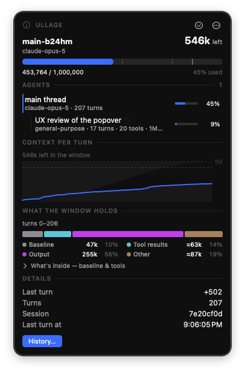
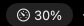

<div align="center">


# Ullage

**See how full your Claude Code context window is, live, from the menu bar.**

</div>

Ullage watches your Claude Code and OpenAI Codex CLI session transcripts, keeps
every API call in a local SQLite database, and shows the context window's fill
level as a percentage in the macOS menu bar. It also lists Cursor agent activity,
though Cursor records no token counts locally so it has no fill percentage. Click it to break the current session down turn by turn
and see what is actually taking up the window. A separate history window charts
your activity across days and projects.

Everything stays on your machine. Nothing is uploaded, and nothing is sent
anywhere unless you ask for it: there is one command that exports — `ullage
otlp`, for aggregating across machines — it runs only when you run it, and
`--dry-run` prints exactly what would leave first.

> **Ullage** — the empty space left at the top of a barrel or tank. Here, the
> room still left in the context window.

## What it looks like

<div align="center">



</div>

- **Menu bar:** a gauge icon whose needle rises with occupancy, followed by the
  percentage &nbsp;&nbsp;. It
  turns amber past 85%, and drops to a plain gauge with no number once a session
  has been idle for 30 minutes, so a stale figure is never mistaken for a live
  one.
- **Popover** — click the menu bar item for:
  - **the room left in the window**, in tokens, over a bar marked at 85% and at
    the session's own peak, with the exact `used / window` beneath it;
  - the **subagents that session spawned**, as the tree that spawned them, each
    named by the description the agent above it wrote and each with **its own
    window and occupancy** — click one and the chart, the breakdown and the
    figures below switch to its context, and say so;
  - a chart of context tokens per turn, where the band above the line is the
    room left, with the 85% line and a marker wherever a compaction dropped the
    window (hover for the exact turn, tokens, and change);
  - a bar of **what the window holds right now** — baseline, tool results,
    output, and everything else — with `≈` on the figures that are estimates,
    and a "What's inside" button that expands to the baseline's parts
    (CLAUDE.md, MCP servers, skills) and a per-tool table of what is sitting in
    the window;
  - the last turn's change, turn count and last-active time.

  It follows the most recently active session and holds still on it while the
  popover is open. The chevron at the top switches session — grouped by
  project, since a session id is not a name — and stays accented while one is
  pinned.
- **History window** — the History button opens activity per day stacked by
  project over 7, 30, 90, or 365 days, switchable between turns, output tokens,
  and cache reads; a table of every session in range with its agent count; and
  the selected session's agent tree, chart and full composition.

## Install

Requires macOS 14 or later, and Swift 6 (Xcode 16) to build.

```bash
git clone https://github.com/sturdynut/Ullage.git
cd Ullage
scripts/install-app.sh          # builds, bundles Ullage.app, installs to /Applications
open /Applications/Ullage.app
```

Pass a directory to install elsewhere, e.g. `scripts/install-app.sh ~/Applications`.

Because the app is ad-hoc signed rather than notarized, the first launch may draw
a Gatekeeper warning; right-click the app and choose **Open**, or approve it once
under System Settings → Privacy & Security. To start it at login, add Ullage
under System Settings → General → Login Items.

### Before you lose history

Claude Code deletes session transcripts older than `cleanupPeriodDays` at
startup. The default is 30 days, the deletion is silent, and pruned sessions
cannot be recovered. Raise it in `~/.claude/settings.json` **before** you rely on
Ullage for history:

```json
{ "cleanupPeriodDays": 3650 }
```

Then pull your existing sessions into the database so the charts have history:

```bash
swift build
.build/debug/ullage backfill
```

## Using it

Ullage runs quietly in the menu bar and updates within a couple of seconds of
each turn. There is nothing to configure. Open the popover for the live session,
or the History window for the longer view.

### Command line

The same data is available from a CLI, handy for scripting or a quick look
without the app:

```bash
ullage backfill              # ingest everything on disk, report what is missing
ullage watch                 # tail live; prints what the menu bar would show
ullage sessions              # per-session totals, grouped by project
ullage agents <session>      # the subagent tree, each agent's own window
ullage latest                # the single row driving the menu bar
ullage history [--days N]    # activity per day and project (default 30)
ullage composition <session> # what a session's window is made of
ullage serve [--port N]      # serve the gauge to a browser on 127.0.0.1
ullage otlp --endpoint URL    # export everything measured to an OTLP collector
ullage env <session>         # a session's configuration snapshot
ullage info                  # resolved paths, retention, row counts
```

`agents` prints the main thread and, indented beneath it, every subagent the
session spawned: the name the spawning agent gave it, its type, its turns, and
how full **its own** window got. A subagent starts from an empty context, so its
occupancy is never the session's — and the menu bar gauge never follows one.

`composition` breaks the current window into a baseline (system prompt, tool
schemas, skills, CLAUDE.md, and the opening prompt — or the summary after a
compaction), tool results, assistant output, and the remainder, then lists the
tools whose results are in the window. Every figure but the window total is an
estimate and is labelled as one.

### Aggregating across machines and harnesses

`ullage otlp` sends what Ullage has measured to any collector that speaks
OTLP/HTTP — the OpenTelemetry Collector, Grafana, Honeycomb, Datadog, Jaeger —
so several machines and several harnesses can be looked at in one place.
Sessions become traces, with each turn a span and **each subagent a span under
the turn that spawned it**; tokens, window sizes and occupancy become metrics
under the `gen_ai.*` semantic conventions.

```bash
ullage otlp --dry-run --days 1        # read exactly what would be sent
ullage otlp --endpoint http://localhost:4318
```

Nothing leaves the machine unless you run that command: there is no background
exporter and no telemetry about Ullage itself. Two details matter and are
covered in [`docs/OPENTELEMETRY.md`](docs/OPENTELEMETRY.md) — the export sends
the *whole prompt* as `gen_ai.usage.input_tokens` (Claude's own `input_tokens`
is just the uncached remainder, and exporting that under the standard name would
understate a cached session by three orders of magnitude), and a harness that
reports no tokens exports activity only rather than a misleading zero.

The database is at
`~/Library/Application Support/com.sturdynut.ullage/telemetry.db` (WAL mode).
`--db <path>` or `$ULLAGE_DB` moves it; `$CLAUDE_CONFIG_DIR` moves the transcript
source. Ingestion is incremental and idempotent: re-running it over the same
transcripts changes nothing.

### Reading it from a phone

A menu bar is only useful in front of the Mac. `ullage serve` puts the same
gauge on a web page — the live occupancy, what it is made of, and every recent
session — so a session you are driving from somewhere else is still visible.

```bash
ullage serve                 # http://127.0.0.1:7878, and tails transcripts too
ullage serve --no-watch      # when the app is already running and ingesting
```

It binds **127.0.0.1 and nothing else**, and there is deliberately no flag to
change that. To reach it from a phone, put [Tailscale](https://tailscale.com) in
front:

```bash
tailscale serve --bg 7878    # https://<machine>.<tailnet>.ts.net
```

That gives a real HTTPS certificate for the machine's tailnet name, reachable
only from your own devices — no port forwarding, no LAN exposure, and revoking
it is `tailscale serve --https=443 off`. Ullage itself never opens a socket the
rest of the network can see, so who may reach the page is Tailscale's decision
rather than a flag you have to remember you set.

The page reuses the display rules rather than reimplementing them: the same
floored percentage, the same amber threshold, and the same refusal to show a
number that has gone stale — if the Mac sleeps or drops off the tailnet, the
gauge dims and says so instead of leaving a confident percentage on screen.
Sessions whose harness reports no window show a dash, never `0%`.

[`docs/PHONE.md`](docs/PHONE.md) has the setup in full.

## How the number is computed

The context window is the size of the prompt sent each turn:

```
context_tokens = input_tokens + cache_creation_input_tokens + cache_read_input_tokens
occupancy      = context_tokens / window_limit
```

All three are prompt-side. `input_tokens` alone is only the uncached remainder
and undercounts by an order of magnitude on a cached session. The four token
counters (input, output, cache read, cache write) are kept separate everywhere:
a heavy session is almost entirely cache reads, so any single "total tokens"
number would just be a cache-read figure in disguise. `output_tokens` is stored
as reported, with no correction factor.

Verified by hand against Claude Code's own `/context`: it reported
`129.1k/1m (13%)` while Ullage showed `129,096 / 1,000,000` for the same turn.

Codex reports usage differently — its `input_tokens` is the whole prompt, cached
tokens included, and it states the model's context window on every turn. Ullage
splits that prompt back into the same four counters and reads the window from the
transcript, so no lookup table is needed for Codex and the rows stay exact.

Cursor reports none of this on disk, so its rows carry activity but no tokens and
no window; there is no percentage to compute for a Cursor session.

## Current limitations

- **Full support for two harnesses: Claude Code and the OpenAI Codex CLI.**
  Ullage reads Claude Code's `~/.claude/projects` transcripts and Codex's
  `~/.codex/sessions` rollouts, both with exact occupancy. The `vendor` and
  `confidence` columns keep each harness's numbers distinct.
- **Cursor is activity-only.** Cursor is a server-backed IDE: its token and
  context accounting lives on Cursor's servers, and the local agent transcripts
  (`~/.cursor/**/agent-transcripts`) hold conversation content but no token
  counts, model, window, or timestamps. Ullage lists Cursor sessions with their
  turn and tool counts (timed by the file, `confidence = unmeasured`) but shows
  no occupancy, and a Cursor session never drives the menu bar gauge. GitHub
  Copilot, Aider, and the rest are not read at all.
- **Cloud and web sessions are invisible.** Both harnesses can run in the cloud
  (Claude Code on the web, Codex cloud tasks); those transcripts stay on the
  server with no public per-session usage API, so only sessions that write to
  local disk are seen. `claude --teleport <id>` pulls a cloud Claude session
  down as a one-time local copy, which Ullage then reads.
- **The transcript formats are private and versioned**, not public contracts,
  and change between releases. Validated against Claude Code 2.1.270 and Codex
  CLI 0.145–0.146; after an upgrade a window size or field location can shift.
  `scripts/recon.sh` re-checks the Claude format against your disk, and
  [`docs/OBSERVED-FORMAT.md`](docs/OBSERVED-FORMAT.md) records what was seen.
- **Claude window sizes are a lookup table** (Codex reports its window exactly on
  every turn). A Claude model Ullage does not recognize falls back to 200k and is
  flagged as assumed, so its percentage may be wrong until the table is updated.
- **macOS 14+ only**, and the app is unsigned and un-notarized — a local build,
  not a distributed release.
- **The menu bar item can be hidden.** On Macs with a notch and many menu bar
  apps, macOS may tuck Ullage's item out of sight; a menu bar manager can pin it.
- Composition figures other than the window total are **length-based estimates**,
  not exact token counts, and subagent (`Task`) usage rolls into its parent
  session.

## Building from source

The collector (`Sources/UllageCore`) and the CLI (`Sources/ullage`) have no
macOS-only dependencies and build and test on Linux as well as macOS. The app
(`Sources/UllageApp`) is macOS only.

```bash
swift build
swift test        # runs on Linux or macOS
```

Layout:

```
Sources/UllageCore/    parsers (Claude Code, Codex, Cursor), ingestor, SQLite
                       store, and all analysis/display logic (kept UI-free)
Sources/ullage/        the command-line tool
Sources/UllageApp/     the SwiftUI menu bar popover and history window (macOS)
Tests/                 unit tests for the collector and every display rule
scripts/recon.sh       inspect the on-disk transcript format
scripts/install-app.sh build, bundle, and install the app
docs/                  the observed transcript format
```
